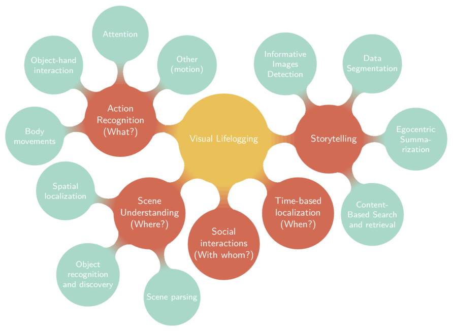

# Visual lifelogging mental map

This is a Latex code for generating the Visual lifelogging mental map displayed below. This map is based on our team's overview paper [Towards Storytelling from
Visual Lifelogging: An Overview](http://arxiv.org/pdf/1507.06120.pdf).

